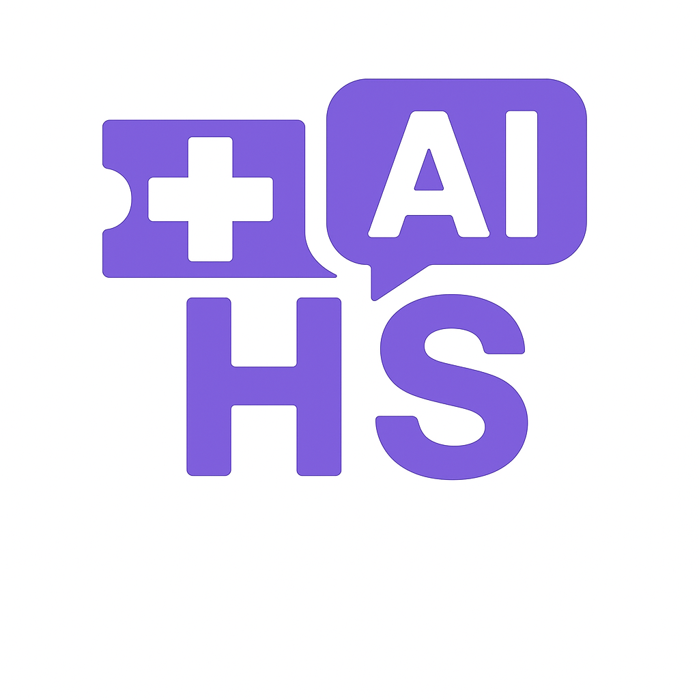
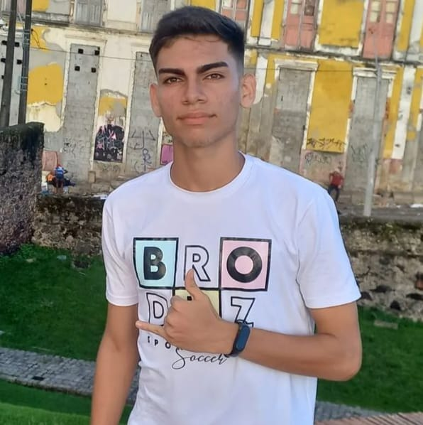

# Sistema de Suporte e Teleconsulta HC

## 📌 Descrição do Projeto
Este projeto consiste em uma plataforma digital de atendimento para teleconsulta, desenvolvida para otimizar a comunicação entre pacientes e a equipe de suporte da HC. A solução integra chatbot inteligente, criação e gerenciamento de tickets e atendimento humano especializado, proporcionando um fluxo de suporte eficiente, organizado e rastreável.

A plataforma permite que os pacientes registrem suas demandas, incluam descrições detalhadas, anexos e informações sobre a etapa do tratamento, e acompanhem o status de seus tickets em tempo real. Para questões simples ou dúvidas frequentes, o chatbot atua como primeira linha de atendimento, oferecendo respostas imediatas e direcionando casos mais complexos para os atendentes humanos, garantindo agilidade e redução da sobrecarga da equipe.

Para os atendentes, o sistema oferece funcionalidades de visualização detalhada de tickets, filtragem por status, pesquisa por nome ou número de protocolo, além de permitir comentários internos e acompanhamento do histórico de interações. Isso aumenta a produtividade, a organização e a capacidade de priorizar casos críticos.

A plataforma foi desenvolvida com foco em usabilidade, desempenho e acessibilidade, suportando dispositivos desktop e mobile, garantindo que pacientes e atendentes possam interagir de forma simples e intuitiva. Com esse sistema, busca-se melhorar a experiência do paciente, agilizar o fluxo de atendimento e assegurar transparência, confiabilidade e segurança em todas as interações.

---

## 🛠 Tecnologias Utilizadas
- **Front-end:** React, Typescript, Tailwind  


---

## 👨‍👩‍👧‍👦 Integrantes do Grupo

- **Guilherme Santos Fonseca** – RM: 564232  
- **Gustavo Araujo da Silva** – RM: 566526  
- **Anthony de Souza Henriques** – RM: 566188  

---

## 🖼 Imagens e Ícones
### Logo
 

### Tela inicial
  

### Tela inicial
  

### Tela inicial
  

### Chatbot
  

### Timer
  

### Line Chart
 

### Feedback
  

### Perfil do Usuario
  

### Grupo
  

### Integrante 1 
  

### Integrante 2 
  

### Integrante 3 
  

---

## 📂 Estrutura de Pastas do Projeto

```

/assets
  (imagens utilizadas no projeto)

/components
  (componentes utilizados no projeto)

/pages
├── contato.tsx
├── dashboard.tsx
└── faq.tsx 
└── home.tsx 
└── integrantes.tsx 
└── login.tsx 
└── meus-tickets.tsx 
└── novo-ticket.tsx 
└── paciente-page.tsx 
└── tipo-usuario.tsx 

/services
├── ticket-services.ts

/types
├── button.ts
├── card-beneficio.ts
├── card-depoimento.ts
├── card-plano.ts
├── card-solucao.ts
├── cards-integrantes.ts
├── form-input.ts
├── link-rodape.ts
├── ticket.ts

App.tsx
Index.css

```

---

## 🔗 Links Importantes
- **Repositório no GitHub:** [https://github.com/Challenge-Fiap-1TDSPX-2025/front-challenge-react](https://github.com/Challenge-Fiap-1TDSPX-2025/front-challenge-react)

- **Vídeo Demonstrativo no YouTube:** [https://www.youtube.com/watch?v=seuvideo](https://www.youtube.com/watch?v=seuvideo)  

---